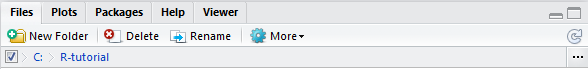
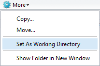

# 1. R and RStudio

## 1.1. Introduction

R is a programming language, originally written in 1992 by Ross Ihaka and Robert Gentleman (yes, "R" stems from the first letter of their first names), inspired by another programming language called S. With an active R Development Core Team and a very large community of R users, R has become one of the leading languages for statistical computing (performing statistical analyses) and graphical display (making plots and figures). For more information about the programming language R, visit:

[R Programming Language](https://www.r-project.org/about.html "R Programming language")

Throughout this tutorial you'll be encouraged to use RStudio. RStudio is a free, open-source "Integrated Development Environment" (IDE) for R (Windows, macOS, and Linux). RStudio is widely used by data analysts (including epidemiologists), is well maintained, and comes with many handy features that make working with R easier. For more information on RStudio, visit:

[R Studio](https://www.rstudio.com/ "R Studio")

## 1.2. Download and install R and RStudio

This subsection guides you through the installation steps for RStudio. You can proceed to section 2 when you already have RStudio installed on your system.

Installing RStudio requires only two steps:

1.  Download and install "base R" from the [R project website](https://cloud.r-project.org/ "R Studio"). You may notice that this installation of base R comes with a simple graphical user interface (GUI). We will not be using this interface in this tutorial.

2.  Download and install RStudio from the [RStudio website](https://www.rstudio.com/products/rstudio/download/ "R Studio") (section "Installers for Supported Platforms").

The video below guides you through the installation process.

[RStudio installation](https://youtu.be/NpqJxhKoVqI "R Studio")

After installation, you should be able to open RStudio and start working with R code.

# 2. A first R session

In this section you'll be introduced to the basic building blocks of R and RStudio. We will move from simple calculations to objects and vectors, which you will later combine into data frames.

Once more: no experience with R, programming, or statistics is required.

Learning goals:

- Perform basic calculations in R
- Create and reuse objects
- Build and use vectors

Section structure:

-   2.1. Introduction to the RStudio interface
-   2.2. Executing commands with health data
-   2.3. Creating objects and vectors

At the end of this section, you'll be able to perform simple computations and work with objects and vectors.

Keep your RStudio window open as you work through the code chunks and exercises.

## 2.1. Introduction to the RStudio interface

Clearly, the first step is to start the RStudio program.

### Basic Interface


The RStudio interface consists of four panels (if you happen to see only three panels, select File \> New File \> R Markdown). We'll focus on the two panels on the left of the screen: the editor window and the console window.

In the editor window you type commands in the R language; this is how you tell R what you want it to do (input).

The console window is where R tells you what it has done with your commands (output).

In the top right panel, you will see the Environment pane: this is where you will see objects that you define in R.

Lastly, in the bottom right panel you will see several tabs. Important ones include: Files (set your working directory), Plots (visualization output), Packages (installed packages and package installation), and Help (documentation for functions and packages).

We will use these panels throughout the tutorial.

### R Markdown

You are going to work in R Markdown! R Markdown is a dynamic document format that combines:

-   Text (with simple formatting using Markdown)

-   R code (that can be executed and displayed)

-   Results (outputs like tables, plots, and text)


Key components of the R Markdown interface:

1.  Editor View Modes (Top of Editor)

-   Source (\</\>): Shows the raw R Markdown code with R chunks and Markdown text.

-   Visual: Shows a preview of how your document will look when knitted (easier for beginners).

Switch between these to edit code or see a live preview.

2.  R Code Chunks

These are sections where you write and execute R code:

-   Start with three backticks and `{r}`, and end with three backticks

-   Contain your R code inside

-   Can be run independently of the whole document

To add a new R code chunk, you can either use Ctrl + Alt + I (Cmd + Alt + I on macOS) or go to the top-right corner of the editor window and select R, just like this:


## 2.2. Executing commands with health data

We are now going to practice executing a simple command in R using health-related numbers. These lines are *simple arithmetic*; focus on **running them** and reading the output. Type in the editor window:

```{r}
# Basic calculations (health context)
120 + 5     # systolic blood pressure after a 5 mmHg increase
180 / 2     # split a 180 mg dose into two
72 * 60     # beats per hour for a 72 bpm heart rate

```

After you run the chunk, you should see three numeric results printed below the code.

To execute this command, place your cursor in the editor window next to the typed command. Left-click on the run/play button located on the upper-right corner of the R chunk to execute it. Alternatively, you may use the keyboard shortcut Ctrl + Enter (Windows) or Cmd + Enter (macOS). When successful, the result will be shown underneath the R chunk or in the console window.


Executing commands line by line can become tedious. To run multiple commands at once, you can select the lines to be executed and use the run button (or the keyboard shortcuts Ctrl + Enter or Cmd + Enter). Alternatively, you can use Ctrl + Shift + Enter or Cmd + Shift + Enter to run all lines in the R chunk.


### Exercise 2.2.1: Practice Calculations

1. Calculate 98 + 7 (mmHg)

2. Calculate 200 ÷ 4 (mg)

3. Calculate 70 × 60 (beats per hour)

4. Calculate 1.75² (m²) (hint: use 1.75 * 1.75 or 1.75^2)


```{r}
# Write your answer below:
```

## 2.3. Creating objects and vectors

R is a so-called object-oriented programming language. In practice, this simply means that it works with objects. An object can be thought of as a container with a name that contains information that you assign to it. To create an object, start by typing the name for the object. After specifying the name, we write \<-, followed by the content of the object. Suppose we want to create an object called result and we want to assign to it the numeric result of 10 * 2. Type in the editor window:

### Object

```{r}

result <- 10 * 2 

result
```

This stores the value in `result` and then prints it to confirm the assignment (**assignment uses** `<-`).

Notice that the object result that you just created is listed in the Environment pane in the upper-right panel of the RStudio interface.

### Exercise 2.3.1: Create an object

Create an object called `baseline_bp` using the result from Exercise 2.2.1 #1. Then create `followup_bp` by adding 5.

```{r}
# Write your answer below:
```


So far, we have only discussed objects with a single numeric value or character value: a single data point. Multiple data points can be combined into a single object as a vector. In short, a vector contains a sequence of values. To create a vector use the function c() (short for concatenate).

### Vector

Suppose we measured blood pressure readings for five individuals (hereafter referred to as subjects): 120, 135, 118, 142, and 128 mmHg. The first individual has a 120 mmHg blood pressure reading, the second 135 mmHg, etc. Try to run:

```{r}
c(120, 135, 118, 142, 128)
```

You should see a sequence of five values printed in the console.

### Exercise 2.3.2: Run a vector

Create a vector called `glucose` with five glucose readings: 92, 105, 98, 110, 88.

```{r}
# Write your answer below:
```


The blood pressure data can be stored as a vector in an object called `bp_readings`. Try to run:

```{r}
bp_readings <- c(120, 135, 118, 142, 128)
bp_readings
```

Now the values are stored in `bp_readings`, so you can reuse them in later calculations (for example, `bp_readings + 10`).

### Exercise 2.3.3: Create a vector

Create a vector called `heart_rate` with five values: 72, 68, 75, 80, 70. You'll use it in the next exercise.

```{r}
# Write your answer below:
```

After you assign a vector to an object, you can do operations or use functions on it. Try to run:

```{r}
# Add 10 to all blood pressures and assign it to a new object called higher_bp
higher_bp <- bp_readings + 10
higher_bp

# Find the maximum blood pressure and assign it to a new object called max_bp
max_bp <- max(bp_readings)
max_bp
```

Notice how the calculations happen element-by-element for the vector and produce a new vector or a single summary value.

### Exercise 2.3.4: Use a function on a vector

Create a new object called `avg_hr` with the average heart rate of `heart_rate`. Use the function mean().

```{r}
# Write your answer below:
```

Finally, and please remember this, R is case-sensitive. This means that result, Result, and RESULT are all different objects in R. It is good practice to avoid using capital letters; this will prevent unnecessary frustrations.


# 3. Data frames

In this section we'll show how to work with two-dimensional data in R. While there are various ways of doing so in R, we will focus on data frames because they are the most common format for health data. We start with a quick preview, then build data frames step by step, and finally practice common tasks.

If you are familiar with data analysis in other programs than R, you might realize that this approach is unlike those other programs. In MS Excel, such data would be stored in a spreadsheet. A data frame is R's version of that spreadsheet: rows represent individuals (patients) and columns represent variables (age, blood pressure, and so on). Keep that picture in mind as you go through the preview below.


Section structure:

-   3.1. A small patient data frame (preview)
-   3.2. Constructing a data frame from two vectors
-   3.3. General construction of a data frame
-   3.4. Working with data frames
-   3.5. Importing a data frame

At the end of this section, you'll be able to construct and understand the basic structure of data frames in R.

Later sections will reuse some of these data frames, so keep your objects in the environment.

Learning goals:

- Describe rows vs. columns in a data frame
- Construct data frames from vectors
- Add new columns to an existing data frame

## 3.1. A small patient data frame (preview)

This short preview shows what a data frame looks like before we build one step by step.

```{r}
patient_df <- data.frame(
  id = c(1, 2, 3, 4),
  age = c(45, 52, 37, 61),
  sbp = c(128, 135, 120, 142)
)
patient_df
```

This is a small table where each row is a patient and each column is a variable (**rows = individuals, columns = variables**).

### Exercise 3.1.1: Preview a data frame

Create a data frame called `vitals_df` with columns `id`, `temp_c`, and `pulse`. Use `id = 1:4`, `temp_c = c(36.7, 37.1, 38.0, 36.5)`, and the first four values of `heart_rate` for `pulse`.

```{r}
# Write your answer below:
```

## 3.2. Constructing a data frame from two vectors

Remember that, to create a vector, we use the function c() (if you forgot all about vectors, see section 2.3). Suppose we have measured height (in cm) and recorded sex (m/f) for 16 individuals. To store these data in two vectors, type and run:

```{r}
height <- c(184.0, 174.2, 166.6, 193.2, 
            173.8, 166.4, 175.4, 183.3, 
            159.4, 171.8, 179.2, 165.8, 
            170.4, 178.1, 171.4, 159.7)
sex <- c('m', 'm', 'm', 'm', 'm', 'm', 
         'm', 'm', 'f', 'f', 'f', 'f', 
         'f', 'f', 'f', 'f')
```

### Exercise 3.2.1: Create two vectors

Create two vectors called `weight_kg` and `smoker` for six patients using these values:

- `weight_kg`: 62, 74, 81, 69, 90, 77
- `smoker`: 0, 1, 0, 0, 1, 0

```{r}
# Write your answer below:
```


For these data, the rows represent different individuals (person 1 to 16) and the columns represent different variables (height and sex). To create this in R we can use the function data.frame(). Type and run:

```{r}
dat <- data.frame(height, sex) 
dat 
```

The order of the data points in both vectors is important. When combining both vectors into one data frame, we must be sure that the first observation in the vector height (184.0) is from the same individual as the first observation in the vector sex ("m"), that the second observation in the vector height (174.2) is from the same individual as the second observation in the vector sex ("m"), and so on. In practice, vectors must also have the same length.

### Exercise 3.2.2: Create a data frame

Create a data frame called `patients_df` from `weight_kg` and `smoker` from Exercise 3.2.1.

```{r}
# Write your answer below:
```

## 3.3. General construction of a data frame

Clearly, the approach of first creating two vectors, combining them into a data frame, and then removing the two vector objects from the environment is a bit of a hassle. This task can be simplified by creating the data frame in one step. Type and run:

```{r}
dat <- data.frame( 
  height = c(184.0, 174.2, 166.6, 193.2, 173.8, 166.4, 175.4, 183.3, 159.4, 171.8, 179.2, 165.8, 170.4, 178.1, 171.4, 159.7), 
  sex = c('m', 'm', 'm', 'm', 'm', 'm', 'm', 'm', 'f', 'f', 'f', 'f', 'f', 'f', 'f', 'f') 
                   ) 
```

The command above should be read as follows: "Create a new object called dat, and let it be a data frame that has one column named height with values (184.0, 174.2, ..., 159.7) and one column named sex with values (m, m, ..., f)."

### Exercise 3.3.1: Build a data frame in one step

Create a data frame called `patients_df2` in one step using the same `weight_kg` and `smoker` values from Exercise 3.2.1, and add an `age` column with values: 34, 45, 52, 39, 61, 48.

```{r}
# Write your answer below:
```


Now suppose that, for these same subjects, additional data has become available because their current smoking status (0: current non-smoker or 1: current smoker) was recorded. We want to add a column called smoking_status to the data frame dat. To do this, type and run:

```{r}
dat$smoking_status <- c(0, 0, 0, 0, 0, 1, 0, 0, 1, 0, 0, 1, 1, 0, 1, 0) 
dat 
```

This is a common pattern: start with a base data frame, then add new columns as you collect more variables.

### Exercise 3.3.2: Add a column

Add a numeric column called `weight_plus5` to `patients_df2` by adding 5 to `weight_kg`. Then print `patients_df2`.

```{r}
# Write your answer below:
```

## 3.4. Working with data frames

In this subsection we'll practice common data frame actions using a small health dataset. These actions include previewing rows, inspecting column types, selecting columns, and creating new variables.

```{r}
patient_data <- data.frame(
  id = c(1, 2, 3, 4, 5),
  age = c(45, 52, 37, 61, 49),
  bp = c(128, 135, 120, 142, 130),
  height_m = c(1.72, 1.68, 1.74, 1.60, 1.70),
  weight_kg = c(78, 82, 74, 68, 80)
)

# View the data frame
patient_data

# Check the structure
str(patient_data)
```

The first line prints the data frame, and `str()` gives a compact summary of each column's type.

### Exercise 3.4.1: View and inspect a data frame

Create `patient_data2` with at least `age`, `bp`, `height_m`, and `weight_kg` using these values. Then view it and check its structure. You will reuse `patient_data2` in the next two exercises.

- `age`: 41, 58, 36, 63, 50
- `bp`: 124, 138, 118, 145, 132
- `height_m`: 1.70, 1.65, 1.78, 1.60, 1.72
- `weight_kg`: 70, 84, 72, 66, 79

```{r}
# Write your answer below:
```

```{r}
# View the first few rows
head(patient_data)

# Get a specific column
patient_data$age
patient_data$bp
```

These examples use `patient_data`. In the exercises, use your own `patient_data2`. Use `head()` to preview rows and the `$` operator to pull out single columns (for example, `patient_data$bp` gives the blood pressure column).

### Exercise 3.4.2: Select rows and columns

Use `head()` on `patient_data2`, then extract the `age` and `bp` columns from `patient_data2`.

```{r}
# Write your answer below:
```

```{r}
# Add a new column (from our previous exercise)
bmis <- patient_data$weight_kg / (patient_data$height_m ^ 2)
patient_data$bmi <- bmis
patient_data
```

Here we compute BMI and attach it as a new column. The formula is *BMI = weight_kg / (height_m^2)*.

### Exercise 3.4.3: Add a column

Compute BMI for `patient_data2` using `weight_kg / (height_m ^ 2)`, store it in a new column called `bmi`, and print the updated data frame.

```{r}
# Write your answer below:
```

## 3.5. Importing a data frame

If you need to manually digitize data for more than a few patients, spreadsheet programs (MS Excel, for instance) are more convenient for building such data sets. Once you have finished building your data set, or if you work with an existing data set, you can (and should!) use R to perform your analyses.

In this section you will learn how to “import” and “save” data of different file types in R.

### Working directory

To keep track of your data analysis, it is good practice to store your data and associated files in one directory (i.e., a folder). This is called the working directory. Let's say "C:/R-tutorial" is your working directory. In RStudio you can define the working directory in two ways.

Setting the working directory, method 1: browsing

Manually browse to the working directory in the lower-right RStudio panel by a left click on the "..." button:



Browse to the working directory and then:



Setting the working directory, method 2: using the setwd function

Use the setwd() function:

```{r}
setwd("C:/R-tutorial") # please use your chosen directory, this is just an example
```

*Note:* Replace the path with your own folder.

Setting the working directory lets you use short file names (like "data.csv") instead of full file paths.
### Exercise 3.5.1: Set a working directory

Use `setwd()` to set your working directory to `C:/R-tutorial`.

```{r}
# Write your answer below:
```

Notice that R uses / for defining directory paths, instead of `\\` (the standard on Windows OS).

To practice loading data in R we will use an illustrative data set on Metabolic Syndrome. Details and explanation about this data set can be found in the Excel file "Data Explanation.xlsx" included with this tutorial. In brief, the data set consists of 200 observations (rows) on 15 variables (columns).

### CSV file

Another commonly used data format is the comma-separated values (CSV) file. To view this file you can open it in a simple text editor such as Notepad or in a spreadsheet program such as MS Excel. To import the CSV file in R you can use the read.csv() function:

```{r}
df2 <- read.csv(file = "ShortMetabolicSyndromeVer32.csv")
```

*Note:* If your file is stored elsewhere, update the path.

If your file is not in the working directory, you can use the full path. For example:

```{r}
df2 <- read.csv(file = "C:/R-tutorial/data/ShortMetabolicSyndromeVer32.csv")
```

This is useful when your data is stored in a different folder.
*Note:* Replace the path with your own folder.

### Exercise 3.5.2: Import a CSV

Import the same CSV into an object called `met_syn_df`. You will use `met_syn_df` in section 4.4.

```{r}
# Write your answer below:
```

Notice that some CSV files may have other so-called separation characters (separating the columns) than the comma. For instance, columns may be separated by a semicolon. To import such data you can add an additional argument: sep = ";" to the read.csv() function.

If your column names differ (for example, `age` instead of `AGE`), update the code in later sections to match your file.

# 4. Subset selection

Working with data commonly involves subset selection. For instance, you may need to replace certain values in the data set, or you may want to restrict analysis or computations to a specific subgroup of the data set.

Section structure:

-   4.1. Load and preview a data frame
-   4.2. Logical operators for filtering
-   4.3. Subset by row and column positions
-   4.4. Risk stratification with ifelse
-   4.5. Tables and proportions

At the end of this section you'll be able to select subsets of data directly from a data frame and summarize results.

We will use `df` from the imported CSV for all examples in this section.

Dataset note: this section assumes your CSV contains `AGE`, `BMI`, and `Gender`. If your column names differ, update the code accordingly.

Learning goals:

- Filter rows using logical conditions
- Create new categorical variables with `ifelse()`
- Summarize results with tables and proportions

## 4.1. Load and preview a data frame

We will make use of the Metabolic Syndrome data for the remainder of this section. Be sure that ShortMetabolicSyndromeVer32.csv is stored in your working directory (if you forgot about the working directory, skip back to section 3.5). If you completed Exercise 3.5.2, use the imported data frame here. Type and run:

```{r}
df <- met_syn_df
head(df)
```

This assigns the imported data to `df` and shows the first few rows so you can confirm it loaded correctly.

You should see a small preview of the dataset and its column names.

### Exercise 4.1.1: Load and preview

Reassign `met_syn_df` to `df` and view the first 10 rows with `head(df, 10)`.

```{r}
# Write your answer below:
```

## 4.2. Logical operators for filtering

Logical operators help you filter rows based on conditions. This is a **core tool** for selecting subgroups (for example, older adults or patients with *high BMI*).

-   < (less than)
-   <= (less than or equal to)
-   >= (greater than or equal to)
-   > (greater than)
-   != (not equal to)
-   == (equal to)

For example, to keep only participants aged 70 or older:

```{r}
df_age70 <- df[df$AGE >= 70, ]
df_age70
```

This keeps only rows where the condition is TRUE.

You can also combine conditions with:

-   & (AND)
-   | (OR)

For example, to keep males aged 70 or older:

```{r}
df_male_70 <- df[df$Gender == 1 & df$AGE >= 70, ]
df_male_70
```

With `&`, both conditions must be TRUE for a row to be kept.

### Exercise 4.2.1: Filter with logical operators

Create `df_female_60` that keeps only females (`Gender == 0`) aged 60 or older. Then print the first 6 rows.

```{r}
# Write your answer below:
```

### Exercise 4.2.2: Use OR

Create `df_age70_or_obese` that keeps rows with `AGE >= 70` **or** `BMI >= 30`. Then print the number of rows using `nrow()`.

```{r}
# Write your answer below:
```

## 4.3. Subset by row and column positions

Data frames are two-dimensional, and it is possible to extract values based on row and column numbers. The number given before the comma indicates the row number; the number given after the comma indicates the column number. Type and run:

```{r}
df[5, 2] 
df[c(1, 2, 3), 2] 
```

The first line returns one cell; the second returns multiple rows from one column.

To select only rows 10 and 11, or only columns 1 and 2, type and run:

```{r}
df[c(10, 11), ]
df[, c(1, 2)]
```

Leaving a blank before or after the comma means "all rows" or "all columns".

You should see either a single value or a small table, depending on the indexing.

### Exercise 4.3.1: Select rows and columns

Extract rows 1 to 5 from columns 2 and 4 of `df`.

```{r}
# Write your answer below:
```

## 4.4. Risk stratification with ifelse

You can create a simple risk group using `ifelse()`. The idea is: if a condition is TRUE, return one label; otherwise, return another. For example, classify participants as "high" risk if BMI is 30 or higher:

```{r}
df$risk_group <- ifelse(df$BMI >= 30, "high", "low")
head(df)
```

This creates a new categorical column based on a **simple rule** (TRUE/FALSE decision). After running the code, check the last columns in `df` to see the new group variables.

You can also use two conditions in a single `ifelse()` with `&` (AND) or `|` (OR). For example, label participants as "high" only if both BMI and AGE are high:

```{r}
df$high_bmi_age <- ifelse(df$BMI >= 30 & df$AGE >= 70, "high", "not_high")
head(df)
```

This checks two conditions at the same time and still returns one label per row.

You can also create a three-level group by nesting `ifelse()`. This uses three rules in one line:

```{r}
df$age_group <- ifelse(
  df$AGE >= 80, "80plus",
  ifelse(df$AGE >= 70, "70_79", "under70")
)
head(df)
```

Here the first rule checks AGE ≥ 80, the second rule checks AGE ≥ 70, and the last category captures everyone else.

### Exercise 4.4.1: Create a risk group

Create `age_risk` using `ifelse()` where participants aged 70 or older are "high" risk and others are "low". Store it as a new column in `df`.

```{r}
# Write your answer below:
```

### Exercise 4.4.2: Create three groups with nested ifelse

Create a column called `age_group_alt` with three levels using these rules:

- "80plus" if `AGE >= 80`
- "70_79" if `AGE >= 70` and `< 80`
- "under70" otherwise

```{r}
# Write your answer below:
```

### Exercise 4.4.3: Create three BMI groups

Create a column called `bmi_group` with three levels using these rules:

- "obese" if `BMI >= 30`
- "overweight" if `BMI >= 25` and `< 30`
- "healthy" otherwise

```{r}
# Write your answer below:
```

## 4.5. Tables and proportions

Once you have a risk group, you can summarize it with counts and proportions. These summaries help you report how common each category is.

### 4.5.1 Tables

`table()` counts how many rows fall into each category:

```{r}
table(df$risk_group)
```

### 4.5.2 Proportion tables

`prop.table()` converts counts to proportions:

```{r}
prop.table(table(df$risk_group))
```

The first line counts each group; the second converts counts to proportions.

You can also make a two-way table to compare groups, then convert it to row proportions:

```{r}
table(df$age_group, df$Gender)
```

```{r}
prop.table(table(df$age_group, df$Gender), 1)
```

In `prop.table(..., 1)`, the `1` means "compute proportions by rows" (row-wise). Use `2` for column-wise proportions.

The second line shows the proportion of gender within each age group.

You should see proportions that add up to 1 across each row.

### Exercise 4.5.1: Table and proportions

Create a table for `age_risk`, then create a proportion table for `age_risk`.

```{r}
# Write your answer below:
```

### Exercise 4.5.2: Two-way table

Create a two-way table of `bmi_group` by `Gender`, then compute row proportions with `prop.table(..., 1)`.

```{r}
# Write your answer below:
```

# 5. Saving a data set

After adjusting or subsetting a data set, you may wish to store this new data set as a new file. The format of the new file may or may not be the same as the format of the original file. For instance, the subset `df_age70` from section 4.2 can be saved as a CSV file using:

If a file with the same name already exists, R will overwrite it, so choose names carefully.

Learning goals:

- Save a data frame as a CSV
- Use file paths and avoid accidental overwrites

```{r}
write.csv(x = df_age70, file = "New_ShortMetabolicSyndromeVer32_age70.csv", row.names = FALSE) 
```

The `row.names = FALSE` argument prevents R from writing row numbers as an extra column in the output file.

### Exercise 5.1: Save a subset

Save `df_age70_or_obese` as `New_ShortMetabolicSyndromeVer32_age70_or_obese.csv`.

```{r}
# Write your answer below:
```

Check whether the file New_ShortMetabolicSyndromeVer32_age70.csv is stored in your working directory.

Alternatively, if you want to save to a specific file path:

```{r}
folder_path = "C:/R-tutorial/ShortMetabolicSyndromeVer32.csv"

write.csv(x = df, file = folder_path, row.names = FALSE) 
```

*Note:* Replace the path with your own folder.

### Exercise 5.2: Save to a path

Save `df` to `C:/R-tutorial/ShortMetabolicSyndromeVer32_all.csv`, and turn off row names.

```{r}
# Write your answer below:
```

*Note:* Replace the path with your own folder.

# Final exercise: End-to-end practice

This final exercise ties together the main skills from the tutorial: importing data, previewing it, subsetting rows, creating new variables, summarizing results, and saving output.

1. Set your working directory with `setwd()` if needed.
2. Import `ShortMetabolicSyndromeVer32.csv` into an object called `final_df`.
3. Preview the data with `head()` and check the structure with `str()`.
4. Create `final_subset` that keeps participants with `AGE >= 70` and `BMI >= 30`.
5. Create `final_risk` using nested `ifelse()` with three levels based on BMI:
   - "obese" if BMI >= 30
   - "overweight" if BMI >= 25 and < 30
   - "healthy" otherwise
6. Create a two-level age group `final_age_group` using `ifelse()`:
   - "80plus" if AGE >= 80
   - "under80" otherwise
7. Make a table and a proportion table of `final_risk`.
8. Make a two-way table of `final_risk` by `final_age_group`, then compute row proportions.
9. Save `final_subset` as `C:/R-tutorial/Final_Subset.csv` without row names.

*Note:* Replace the path with your own folder.

```{r}
# Write your answer below:
```

# What to do next

Try repeating the final exercise with a different subset (for example, AGE >= 40) and compare the tables.

# Citation and next steps

This markdown is adapted from <http://r-tutorial.nl/>.

This is the end of this R tutorial.

We have touched upon a few important features of the R programming language and RStudio. We hope you want to learn more. For those who are interested, we have a couple of suggestions to help you find your way.

## Learn about statistics

We believe that knowing about statistics is important if you want to be successful in data analyses. If you have no or limited undergraduate training in statistics, you might want to learn about statistics before you start working on your fluency in the R language.

## Classroom (Utrecht, The Netherlands):

-   10-day course in biomedical statistics: Introductory biostatistics for researchers.

-   Masters program in epidemiology (including Medical Statistics specialisation track): MSc Epidemiology.

These programs combine learning about medical statistics with programming in R.

## Virtual classroom:

-   A nice visual introduction to the concepts of statistics (free!) by Daniel Kunin: Seeing theory.

-   Masters program in epidemiology: MSc Epidemiology online.

-   The R Programming Software and Statistics Tutorials on YouTube, by MarinStatsLectures.

## Books:

-   Benjamin Yakir: ‘Introduction to Statistical Thinking (With R, Without Calculus)’. Available for free online here.

-   Field, Miles & Field: ‘Discovering Statistics Using R’. Available on Amazon.

## Learn about the R programming language

Certainly, this R tutorial only covered some of the basics of programming in R. The following references will help you further:

## Virtual classroom:

-   The Coursera courses: R programming and Advanced R programming, free to audit (not free if you need a course certificate)

-   Try R, a website that introduces R interactively from within your browser.

-   Swirl, an R package that introduces R interactively from within the R console.

## Book:

Grolemund & Wickham: ‘R for data science’, Available for [free](http://r4ds.had.co.nz/ "Free R Book")
